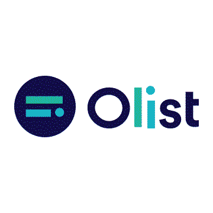
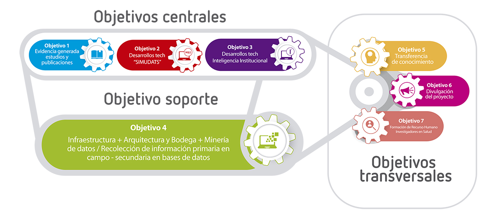

### PROYECTO FINAL - OLIST E-COMMERCE

## FASE 1

### TABLA DE CONTENIDO

1. Entendimiento de la situación
2. Objetivos
3. Alcances
4. Objetivos y KPIs asociados (planteo)
5. Repositorio Github
6. Solución propuesta

### 1. ENTENDIMIENTO DE LA SITUACION

**“Para entender hay que conocer”**.

Al referirnos a OList debemos saber que es un canal de venta e-commerce que facilita este proceso, ya que con un contrato pone los productos de un minorista al alcance de los millones de visitantes de estos marketplaces de forma rápida, fácil y sin complicaciones.

La principal necesidad de los vendedores es clara: **Como vender más, mejor y atraer nuevos clientes?** Por esta razón la misión de Olist es:

**“Nacimos para potenciar el comercio minorista digital y brindar oportunidades reales de crecimiento para pequeñas, medianas y grandes empresas. Existimos para eliminar obstáculos y ayudar a los minoristas a vender más. Derribamos barreras y transformamos lo presencial en online, acelerando los resultados para todos los emprendedores que buscan su espacio en internet”**

La tradición de la tienda física y el volumen de ventas ya no son suficientes para mantener los costos de la operación. Olist cuenta además con el servicio de envío de los productos y el seguimiento postventa para resolver cualquier inconveniente con los compradores como reclamos y devoluciones.

Todo en un solo lugar, industria, importadores, productores, mayoristas, distribuidores, vendedores y compradores compaginados en la sinergia online del comercio electrónico que capta anualmente millones de dólares en ventas. Eso es Olist.

### 2. OBJETIVOS DEL PROYECTO

**Objetivos Generales**:

1. Realizar un proceso de Extracción, Transformación y Carga (ETL) de la información relativa al negocio de la plataforma OLIST para la elaboración y análisis de KPI's y métricas que proporcionen información relevante para la toma de decisiones basada en inteligencia de negocios

2. Implementar y desplegar modelos de Machine Learning que sirvan de ayuda en análisis predictivos o prescriptivos a los participantes del modelo de negocio de OLIST

---

El equipo de desarrollo de Data Science trabajara en el proyecto de Olist e-commerce, en el análisis de los datos obtenidos desde el 2016 al 2018 y se enfocara en la generación de reportes, creación de métricas, aplicación de modelos de machine learning y análisis de las ventas, productos, clientes y vendedores que serán visualizados en un dashboard para ser usados en la toma de decisiones.

**Objetivos Especificos:**

1.1) Elaborar un completo análisis exploratorio y arquitectura de datos adecuada, proporcionando los insumos necesarios para la implementación de distintas herramientas como dashboards, algoritmos o modelos de machine learning.

1.2) Construir un modelo de visualización analítica que permita sistematizar y monitorear los distintos KPI's y métricas relevantes, asi como encontrar patrones e insights, mejorando la inteligencia de negocios.

2.1) Implementar un modelo de recomendación para compradores considerando sus preferencias históricas y de usuarios con perfiles similares

2.2) Implementar un modelo de predicción de las ventas considerando la evolución histórica de las mismas.

---

- Generar un reporte del total de ordenes de venta, productos, vendedores, clientes, y el comparativo de crecimiento de cada uno ellos.

- Generar un reporte total de los cierres de ventas y los no, que tienen incidencia en los ingresos

- Crear un mapa de geolocalización de los vendedores y compradores para observar distancias relativas

- Crear un comparativo de distancia/costo entre vendedores y compradores

- Crear un análisis del tiempo de entrega de los productos

- Generar un reporte de categorización por productos

- Generar un reporte de análisis y calificación de productos

- Generar un reporte de los productos por categoría que tienen más ventas

- Generar un reporte del volumen de ventas por región

- Analizar las ventas en series de tiempo y preferencias

- Analizar los métodos de pago y cual es el de mayor preferencia.

- Analizar el mercado por segmento de negocio, tipo de perfil y tipo de negocio

**Objetivos del equipo de trabajo**

--> Aplicar los conocimientos adquiridos de Data Enginner, ML-Machine Learning y Data Analytics en el proyecto final.

--> Exigirnos en el desarrollo de un proyecto de data science que se asemeje a un entorno laboral y poder aplicar metodologías de trabajo colaborativo.

--> Realizar el análisis exploratorio de los datos y determinar cuales son los features relevantes y hallar valores atípicos que puedan afectar el resultado.

--> Realizar el proceso de ETL en el que se extraen datos de diferentes fuentes, se analizan, se limpian, normalizan los features, modelado ER y luego se cargan en un data warehouse para su posterior uso.

--> Aplicar los modelos de machine learning – ML al proyecto que se consideren útiles en la búsqueda de objetivos claros para al análisis predictivo y prescriptivo.

--> Realizar y mostrar un Dashboard resultado de la analítica de los datos limpios almacenados en el data warehouse.

--> Documentar y almacenar cada uno de los pasos del proyecto en un repositorio que permita visualizar las actualizaciones.

### 3. ALCANCES

En los datasets de Marketplace de e-commerce Olist se realizará un análisis exploratorio de los datos a través del uso de Python para determinar el contenido, estado y uso de los features relevantes que serán utilizados.

El proyecto abarca cuatro (4) fases que contienen específicamente el contenido y pasos a desarrollar.

**En la Fase 1**: se definen los objetivos, alcances, repositorio del proyecto y una solución al problema. En esta fase utilizaremos metodologías de desarrollo colaborativo, tecnologías e interfaces a utilizar, diseño de entregables, cronograma de tiempos, roles y responsabilidades de cada uno de los integrantes.

**En la Fase 2**: corresponde al proceso de Data Enginner en el que se inicia la infraestructura del proyecto. En esta fase realizaremos el modelado de los datos, procedimiento de ETL (Extract, Transform, Load), normalización de los features, se define la estructura de data warehouse, la automatización y validación de los datos. Además de la documentación de ello.

**En la Fase 3**: Corresponde al proceso de Data Analytics y Machine Learning (ML) en el que se desarrollara el mockup de visualización, inclusión de métricas, la definición y pruebas de modelos de ML asi como también la preparación del storytelling del proyecto.

**En la Fase 4**: Es la entrega final del Dashboard definitivo y preparación del storytelling del proyecto. Se repasan y realizan los ajustes y pruebas de ello. Además de organizar y actualizar el repositorio y la documentación correspondiente.

### KPIs

- #### Puntualidad de la entrega (PE)

  - **Área:** Logistica
  - **Objetivo:** Medir el porcentaje de entregas que se realizan a tiempo en relación con el número total de entregas.
  - **Variables:**
    - Número de entregas a tiempo
    - Número total de entregas
  - **Fórmula:** $$ \frac{Número\ de\ entregas\ a\ tiempo}{Número\ total\ de\ entregas}\times 100\text{ \%}$$
  - **Frecuencia de evaluación:** Mensual
  - **Unidad:** Porcentaje [%]
  - **Valor objetivo:** 95 [%]

- #### Tiempo total del proceso (TTP)

  - **Área:** Logistica
  - **Objetivo:** Optimizar los tiempos de compra y envio.
  - **Variables:**
    - Fecha de compra
    - Fecha de recivimiento
    - Número total de compras (N)
  - **Fórmula:** $$\sum_{i=1}^{N} \frac{(Fecha\ de\ recibimiento - Fecha\ de\ compra)}{N}\text{ días}$$
  - **Frecuencia de evaluación:** Mesual
  - **Unidad:** Dias [d]
  - **Valor objetivo:** 8 [d]

- #### Precio promedio del flete por densidad de producto (PPF)

  - **Área:** Logistica
    - **Objetivo:** Evaluar el costo eficiencia del flete, comparando el precio del flete con la densidad del producto.
    - **Variables:**
      - Precio del flete
      - Densidad del producto
    - **Fórmula:** $$\frac{1}{n} \times\sum_{i=1}^{n} \frac{Precio\ de\ flete}{Densidad\ del\ producto}\text{$\$R/\rho$}$$
    - **Frecuencia de evaluación:** Mensual
    - **Unidad:** Reales por densidad [$\$R/\rho$]
    - **Valor objetivo:** _A definir_

- #### Puntuación neta del promotor (PN)

  - **Área:** Ventas
    - **Objetivo:** Medir la satisfacción del cliente
    - **Variables:**
      - Porcentaje de calificaciones positivas (> 3 estrellas)
      - Porcentaje de calificaciones negativas (< 3 estrellas)
    - **Fórmula:** $${Porcentaje\ de\ calificaciones\ positivas} - {Porcentaje\ de\ calificaciones\ negativas}\text{ \%}$$
    - **Frecuencia de evaluación:** Mensual
    - **Unidad:** Porcentaje [%]
    - **Valor objetivo:** 30 [%]

- #### Fidelidad del cliente

  - **Área:** Ventas
    - **Objetivo:** Medir la tasa de clientes que vuelven a comprar dentro de un periodo determinado
    - **Variables:**
      - Número de clientes que volvieron a realizar compras
      - Número total de clientes
    - **Fórmula:** $$\frac{(Número\ de\ clientes\ que\ volvieron\ a\ comprar )}{Número\ total\ de\ compra}\times 100\text{ \%}$$
    - **Frecuencia de evaluación:** Trimestral
    - **Unidad:** [%]
    - **Valor objetivo:** 30 [%]

- #### Tasa de conversión
  - **Área:** Marketing
    - **Objetivo:** Medir la tasa de vendedores potenciales que se unen a la empresa
    - **Variables:**
      - Número total de contactos convertidos
      - Número de contactos interesados
    - **Fórmula:** $$\frac{(Número\ total\ de\ contactos\ convertidos)}{Número\ total\ de\ contactos\ interesados}\times 100\text{ \%}$$
    - **Frecuencia de evaluación:** Trimestral
    - **Unidad:** [%]
    - **Valor objetivo:** 15 [%]
