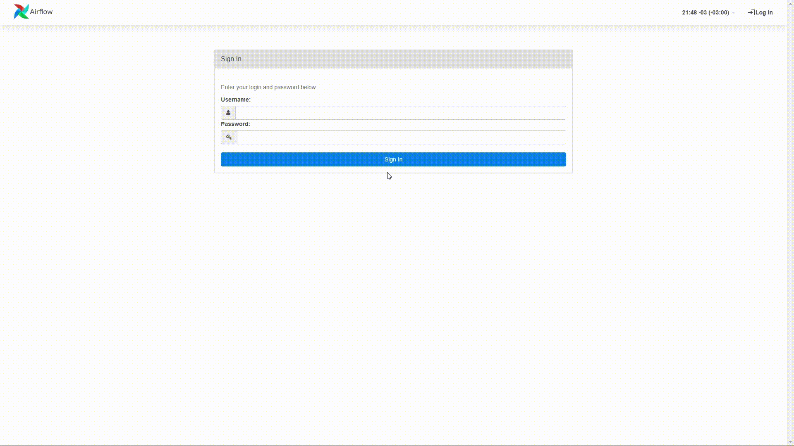

<p align="center">
  
</p>

# PROYECTO FINAL E-COMMERCE OLIST

## Introducción

OList es un completo ecosistema de servicios digitales para la venta online. Su misión es promover el comercio minorista digital y brindar oportunidades reales de crecimiento a todo tipo de empresas, eliminando obstáculos y ayudando a los emprendedores a encontrar su espacio en internet.

En este contexto, se nos encomienda una labor de consultoría y desarrollo de productos en base a un conjunto de datos proporcionados por Olist. Corresponden al periodo de tiempo entre 2016 y 2018 que contienen información relacionada con los departamentos de ventas, logística y marketing.

## Problemática

Asumimos la tarea de convertir los datos brutos de la empresa en información valiosa para mejorar la toma de decisiones, incrementar los beneficios y la calidad del servicio de la empresa.

## Solución propuesta

Hemos implementado un pipeline automatizado para el proceso ETL. Ademas, cada componente del proyecto se ejecuta como un contenedor de Docker, contribuyendo a la escalabilidad y la portabilidad del sistema.

Mediante el uso del framework Streamlit en Python, hemos creado un dashboard para monitorear los KPI y los aspectos críticos del modelo del negocio, ayudando con el proceso de la toma de decisiones.

Adicionalmente, para poner en funcionamiento los modelos de aprendizaje automático, hemos diseñado una aplicación web para satisfacer las necesidades en las áreas de ventas, marketing y logística. En concreto, hemos implementado modelos de series temporales para la predicción de ventas, modelos de recomendación basados ​​en contenido y filtrado colaborativo, y un modelo de regresión para estimar el tiempo de entrega del producto.

## Estructura del repositorio

Este repositorio tiene una estructura organizada para facilitar la gestión del proyecto. A continuación, se describen las carpetas principales y su contenido:

### Carpeta: etapas_del_proyecto

```
.
└── etapas_del_proyecto
    └── etapa_1
    └── etapa_2
    └── etapa_3

```

Esta carpeta contiene los reportes de los avances del proyecto en sus diferentes etapas. Cada etapa está contenida en una carpeta para una fácil gestión.

### Carpeta: data_warehouse

```
.
└── data_warehouse
    └── apache_airflow
    └── datasets
    └── datasets_incremental
    └── etl_module
```

Esta carpeta contiene todo lo relacionado a la implementación de Apache Airflow, los datasets originales del proyecto, los datasets generados para las pruebas de carga incremental y el módulo de ETL desarrollado en Python.

### Carpeta: dashboard

```
.
└── dashboard
    └── app
```

Esta carpeta contiene la aplicación desarrollada en Streamlit que permite la visualización de los datos.

### Carpeta: machine_learning

```
.
└── machine_learning
    └── app
    └── models
    └── notebooks
```

Esta carpeta contiene los notebooks de Python utilizados para las pruebas y generación de modelos de Machine Learning (ML), los modelos generados y la aplicación desarrollada en Streamlit para probar los modelos de ML

## Instalación

El proyecto ha sido desarrollado utilizando Docker, por lo que la instalación es simple. Siga los siguientes pasos para correr el proyecto:

1.  Clone el repositorio:

    ```cmd
    git clone https://github.com/agusdm97/PF-DTS05-E-COMMERCE-OLIST.git
    ```

2.  Navegue hasta la carpeta raíz del proyecto:

    ```cmd
    cd PF-DTS05-E-COMMERCE-OLIST
    ```

3.  Ejecute el siguiente comando para levantar los contenedores de Docker:

    :warning: ADVERTENCIA: El siguiente paso puede ser estresante para algunas computadoras. Por favor, asegúrese
    de tener suficiente memoria y recursos de procesamiento antes de ejecutar este comando.

    ```cmd
    docker-compose up -d
    ```

## Uso

Una vez que los contenedores se encuentran funcionando correctamente deberá seguir los siguientes pasos:

1. Entrar a MinIO y subir los datasets:

Esto se puede lograr entrando al siguiente enlace [MinIO](http://localhost:9090), se debe ingresar con el usuario `root` y la contraseña `password`. Luego de ingresar se tiene que crear un bucket llamado `airflow` y se tienen que cargar los datasets.


2. Entrar a Airflow y activar la DAG:

Esto se puede lograr entrando al siguiente enlace [Airflow](http://localhost:8080), se debe ingresar con el usuario `root` y la contraseña `password`. Luego de ingresar se tiene que ingresar en la DAG llamada `carga_inicial` y activarla.



3. Entrar al Dashboard y a la app de Machine Learning:

Una vez terminado el paso anterior ya se puede acceder al [Dashboard](http://localhost:5050) para visualizar los datos y a la [App-ML](http://localhost:5000) para explorar los modelos de ML.
