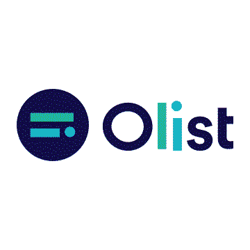
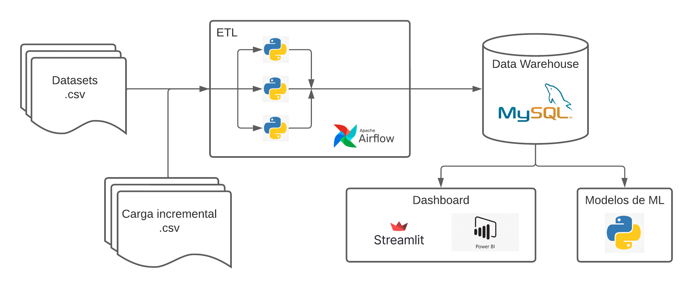
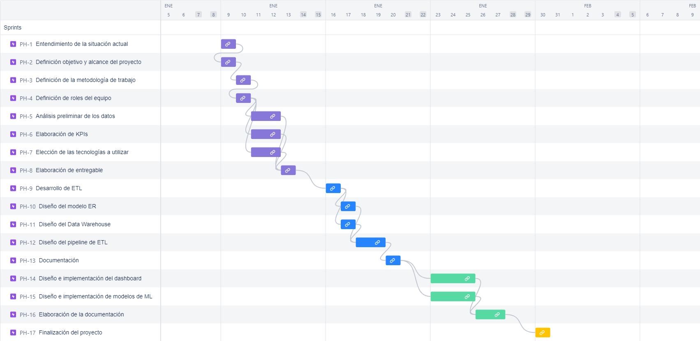

# PROYECTO FINAL - OLIST E-COMMERCE

## FASE 1

### TABLA DE CONTENIDO

1. Entendimiento de la situación
2. Objetivos
3. Alcance
4. Análisis preliminar de los datos
5. Stack tecnológico
6. KPIs
7. Cronograma
8. Solución propuesta

### 1. ENTENDIMIENTO DE LA SITUACION

**“Para entender hay que conocer”**.

OList es un ecosistema de servicios digitales para ventas online. La principal necesidad de los vendedores es clara: **Como vender más, mejor y atraer nuevos clientes?** Por esta razón la misión de Olist es:

**“Nacimos para potenciar el comercio minorista digital y brindar oportunidades reales de crecimiento para pequeñas, medianas y grandes empresas. Existimos para eliminar obstáculos y ayudar a los minoristas a vender más. Derribamos barreras y transformamos lo presencial en online, acelerando los resultados para todos los emprendedores que buscan su espacio en internet”.**

En este contexto, se nos encomienda realizar labores de consultoría con productos entregables basados en un conjunto de datos suministrados por Olist. Estos corresponden al periodo de tiempo que transcurre entre los años 2016 al 2018 y contienen información relativa a los Departamentos de Ventas, de Logística y de Marketing.

### 2. OBJETIVOS DEL PROYECTO

**Objetivos Generales**:

1. Realizar un proceso de Extracción, Transformación y Carga (ETL) de la información relativa al negocio de la plataforma OLIST para la elaboración y análisis de KPI's y métricas que proporcionen información relevante para la toma de decisiones.

2. Implementar y desplegar modelos de Machine Learning que sirvan de ayuda en análisis predictivos o prescriptivos a los participantes del modelo de negocio de OLIST

**Objetivos Específicos:**

1.1) Elaborar un completo análisis exploratorio y arquitectura de datos adecuada, proporcionando los insumos necesarios para la implementación de distintas herramientas como dashboards, algoritmos o modelos de machine learning.

1.2) Construir un modelo de visualización analítica que permita sistematizar y monitorear los distintos KPI's y métricas relevantes, asi como encontrar patrones e insights.

2.1) Implementar un modelo de recomendación para compradores considerando sus preferencias históricas y de usuarios con perfiles similares

2.2) Implementar un modelo de predicción de las ventas considerando la evolución histórica de las mismas.

### 3. ALCANCE

En los datasets de Marketplace de e-commerce Olist se realizará un análisis exploratorio de los datos a través del uso de Python para determinar el contenido, estado y uso de los features relevantes que serán utilizados.

El proyecto abarca cuatro (4) fases que contienen específicamente el contenido y pasos a desarrollar.

**En la Fase 1**: se definen los objetivos, alcances, repositorio del proyecto y una solución al problema. En esta fase utilizaremos metodologías de desarrollo colaborativo, tecnologías e interfaces a utilizar, diseño de entregables, cronograma de tiempos, roles y responsabilidades de cada uno de los integrantes.

**En la Fase 2**: corresponde al proceso de Data Engineer en el que se inicia la infraestructura del proyecto. En esta fase realizaremos el modelado de los datos, procedimiento de ETL (Extract, Transform, Load), normalización de los features, se define la estructura de data warehouse, la automatización y validación de los datos. Además de la documentación de ello.

**En la Fase 3**: Corresponde al proceso de Data Analytics y Machine Learning (ML) en el que se desarrollara el mockup de visualización, inclusión de métricas, la definición y pruebas de modelos de ML asi como también la preparación del storytelling del proyecto.

**En la Fase 4**: Es la entrega final del Dashboard definitivo y preparación del storytelling del proyecto. Se repasan y realizan los ajustes y pruebas de ello. Además de organizar y actualizar el repositorio y la documentación correspondiente.

### 4. ANALISIS PRELIMINAR DE LOS DATOS

En el análisis preliminar de los datos en este proyecto, se llevó a cabo una revisión exhaustiva de los diferentes conjuntos de datos utilizados. A continuación, se presentan las conclusiones obtenidas:

- En el dataset de `geolocation` se encontraron valores en las columnas de latitud y longitud que no pertenecen a Brasil. Además, los nombres de las ciudades se encuentran poco normalizados. Para solucionar este problema, se obtuvieron datos de una fuente externa y se reemplazaron los valores incorrectos en base al código postal.

- En el dataset de `products` se encontraron valores nulos. Sin embargo, estos valores pertenecen a filas enteras de datos nulos, por lo que la solución más adecuada sería simplemente eliminar estas filas.

- En el dataset de `closed deals` se detectaron outliers en la columna de ventas mensuales. Se recomienda analizar estos outliers y determinar cómo proceder con ellos para garantizar la precisión de los resultados finales del proyecto.

En resumen, el análisis preliminar de los datos permitió identificar problemas en los diferentes conjuntos de datos utilizados. Se han propuesto soluciones para corregir estos problemas y se han señalado áreas que requieren una mayor investigación para garantizar la precisión de los resultados finales del proyecto.

### 5. STACK TECNOLOGICO

Es importante destacar que el gráfico representa las tecnologías utilizadas en cada etapa del proyecto y su relación entre ellas, de esta manera se puede ver de manera visual y sencilla como cada tecnología se enlaza con otra para llevar a cabo el proyecto.

- Los datos originales del proyecto están en formato .csv y se contempla la opción de carga incremental para futuros datos que serían provistos en el mismo formato.

- Luego, se utiliza Apache Airflow para programar la ejecución de los programas de Python encargados de extraer, transformar y cargar los datos originales en el Data Warehouse. Esto permite la automatización del proceso de ETL y la ejecución en paralelo de los programas de Python, lo que aumenta la velocidad y eficiencia del proceso. Además, Apache Airflow permite monitorizar el estado de los trabajos y recibir notificaciones en caso de errores o fallos en el proceso.

- El Data Warehouse es un sistema de almacenamiento de datos específicamente diseñado para el análisis de datos. En este proyecto se utiliza MySQL, el cual permite acceder y analizar los datos de manera eficiente. Esto permite obtener información valiosa para la toma de decisiones informadas.

- Estos datos son luego utilizados tanto para la elaboración de modelos de aprendizaje automático como para la elaboración de un dashboard, el cual se utiliza para visualizar y analizar los datos de manera clara y concisa.

### 6. KPIs

- #### Variación porcentual del volumen de ventas por mes (VVV)

  - **Área:** Ventas
    - **Objetivo:** Evaluar aumento o disminución de la variación porcentual del volumen de ventas por mes
    - **Variables:**
      - $V_{actual}$ = volumen de ventas mes actual
      - $V_{anterior}$ = volumen de ventas mes anterior

- **Fórmula:** $$VVV=\frac{V_{actual}-V_{anterior}}{V_{anterior}}\times 100 $$

  - **Frecuencia de evaluación:** Mensual
  - **Unidad:** Porcentaje [%]
  - **Valor objetivo:** 10 [%]

- #### Puntuación neta del promotor (PN)

  - **Área:** Ventas
    - **Objetivo:** Medir la satisfacción del cliente
    - **Variables:**
      - Porcentaje de calificaciones positivas (> 3 estrellas)
      - Porcentaje de calificaciones negativas (<= 3 estrellas)
    - **Fórmula:** $$PN={{ \%}\ calificaciones\ positivas} - {{ \%}\ calificaciones\ negativas}$$
    - **Frecuencia de evaluación:** Mensual
    - **Unidad:** Porcentaje [%]
    - **Valor objetivo:** 60 [%]

- #### Fidelidad del cliente (FC)

  - **Área:** Ventas
    - **Objetivo:** Medir la tasa de clientes que vuelven a comprar dentro de un periodo determinado
    - **Variables:**
      - N° de clientes que volvieron a realizar compras
      - N° total de clientes
    - **Fórmula:** $$FC =\frac{N°\ de\ clientes\ que\ volvieron\ a\ comprar}{N°\ total\ de\ compra}\times 100$$
    - **Frecuencia de evaluación:** Trimestral
    - **Unidad:** [%]
    - **Valor objetivo:** 5 [%]

- #### Tasa de conversión (TC)

  - **Área:** Marketing
    - **Objetivo:** Medir la tasa de vendedores potenciales que se unen a la empresa
    - **Variables:**
      - $N°_{convertidos}$ = Número total de contactos convertidos
      - $N°_{interesados}$ = Número de contactos interesados
    - **Fórmula:** $$ TC=\left(\frac{N°_{convertidos}}{N°_{interesados}}\right)\times 100$$
    - **Frecuencia de evaluación:** Trimestral
    - **Unidad:** [%]
    - **Valor objetivo:** 15 [%]

- #### Puntualidad de la entrega (PE)

  - **Área:** Logística
  - **Objetivo:** Medir el porcentaje de entregas que se realizan a tiempo en relación con el número total de entregas.
  - **Variables:**
    - $N°_{en\ tiempo}$ = Número de entregas a tiempo
    - $N°_{entregas}$ = Número total de entregas
  - **Fórmula:** $$ PE =\left(\frac{N°_{en\ tiempo}}{N°_{entregas}}\right)\times 100$$
  - **Frecuencia de evaluación:** Mensual
  - **Unidad:** Porcentaje [%]
  - **Valor objetivo:** 95 [%]

- #### Tiempo total del proceso (TTP)

  - **Área:** Logística
  - **Objetivo:** Optimizar los tiempos de compra y envío.
  - **Variables:**
    - Fecha de compra
    - Fecha de recibimiento
    - Número total de compras (N)
  - **Fórmula:** $$ TTP= \frac{1}{N}\sum_{i}^{N}\left(Fecha\ recibimiento - Fecha\ compra \right)_i $$
  - **Frecuencia de evaluación:** Mensual
  - **Unidad:** Dias [d]
  - **Valor objetivo:** 8 [d]

### 7. CRONOGRAMA

Este cronograma detalla las tareas e hitos importantes del proyecto, dividido en fases de una semana y culminando en la cuarta fase, siguiendo la metodología Scrum. Cada sprint tiene como objetivo alcanzar metas específicas del proyecto y culmina con una reunión de revisión para evaluar el trabajo realizado en conjunto con el Product Owner. Por último, durante esta fase el equipo diariamente se congrega en una reunión de stand-up para revisar el progreso y identificar cualquier problema y planificar el próximo sprint.

#### Fase 1:Propuesta de proyecto 

- [x] Entendimiento de la situación actual (09/01/2022)
- [x] Definición de objetivo y alcance del proyecto (09/01/2022)
- [x] Definición de la metodología de trabajo (10/01/2022)
- [x] Definición de Roles del equipo (10/01/2022)
- [x] Análisis preliminar de los datos (11/01/2022)
- [x] Elaboración de KPIs (11/01/2022)
- [x] Elección de las tecnologías a utilizar (11/01/2022)
- [x] Elaboración de entregable (11/01/2022)

#### Fase 2: Data Engineering 

- [ ] Desarrollo de ETL (16/01/2022)
- [ ] Diseño del modelo ER (17/01/2022)
- [ ] Diseño del Data Warehouse (17/01/2022)
- [ ] Diseño del pipeline de ETL (18/01/2022)
- [ ] Documentación (20/01/2022)

#### Fase 3: Data Analytics + ML 

- [ ] Diseño e implementación del dashboard (23/01/2022)
- [ ] Diseño e implementación de modelos de ML (23/01/2022)
- [ ] Elaboración de la documentación (26/01/2022)

#### Fase 4: Retoques finales 

- [ ] Finalización del proyecto (30/01/2022)

#### Diagrama de Gantt 

### 8. SOLUCION PROPUESTA

**DATA WAREHOUSE:** Proporciona una arquitectura de datos unificada y actualizable en tiempo real en un esquema batch

**DASHBOARDS DINÁMICOS:** Permite un seguimiento y monitoreo de KPIs en tiempo real, generando nuevos insights y reportes actualizados basados en inteligencia de negocios

**SISTEMA DE RECOMENDACIÓN:** Genera ofertas de productos de interés particular para compradores, aumentando las probabilidades de ventas y retención de clientes

**SISTEMA DE PREDICCIÓN DE VENTAS FUTURAS:** Ayuda a la gestión estratégica del negocio. Entre otras cosas permite anticiparnos al comportamiento de los consumidores, evaluar el rendimiento de los vendedores y manejar cuestiones logísticas como el stock o inversiones inteligentes